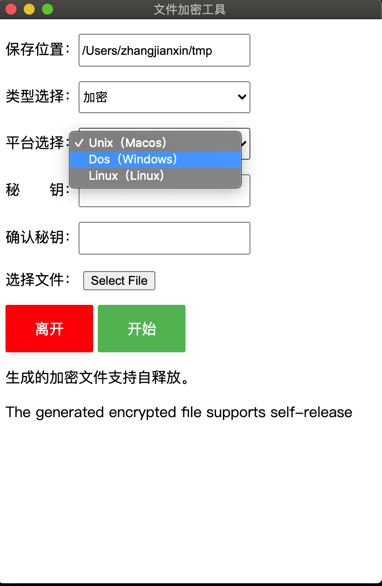
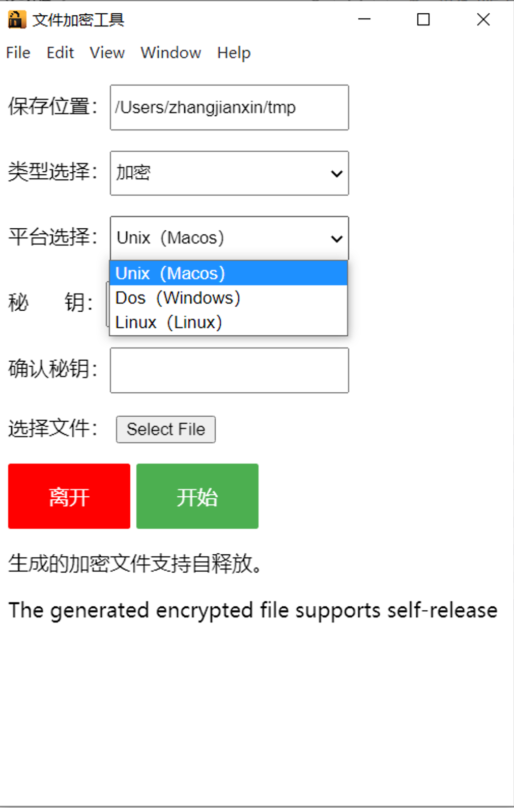

# file_encryption


#### info

```bash
# 将文件加密并且将文件名写在index = 0
# 支持 'https://github.com/substantic/rain' 
```


#### example


```bash

# lib.rs
# 加密
./task e 11111111 0dxZNzzwEFq7PTZWWLoyLx.mp4
# 解密
./task d 11111111 67da3b95-aada-47b8-82c9-7452f2a9d5e4 

#lib_self_release.rs

# 加密
./task e 11111111 0dxZNzzwEFq7PTZWWLoyLx.mp4

# 解密
./67da3b95-aada-47b8-82c9-7452f2a9d5e4 
Please enter password
asdasd
File Name = win_gui.png

```


#### build 


```bash


sudo port install x86_64-w64-mingw32-gcc

rustup target add x86_64-pc-windows-gnu

#                                                /toolchains/xxxxxxxx-apple-darwin/    
cp /opt/local/x86_64-w64-mingw32/lib/* ~/.rustup/toolchains/nightly-x86_64-apple-darwin/lib/rustlib/x86_64-pc-windows-gnu/lib/


cargo build --target x86_64-pc-windows-gnu


```


#### macos





#### windows




