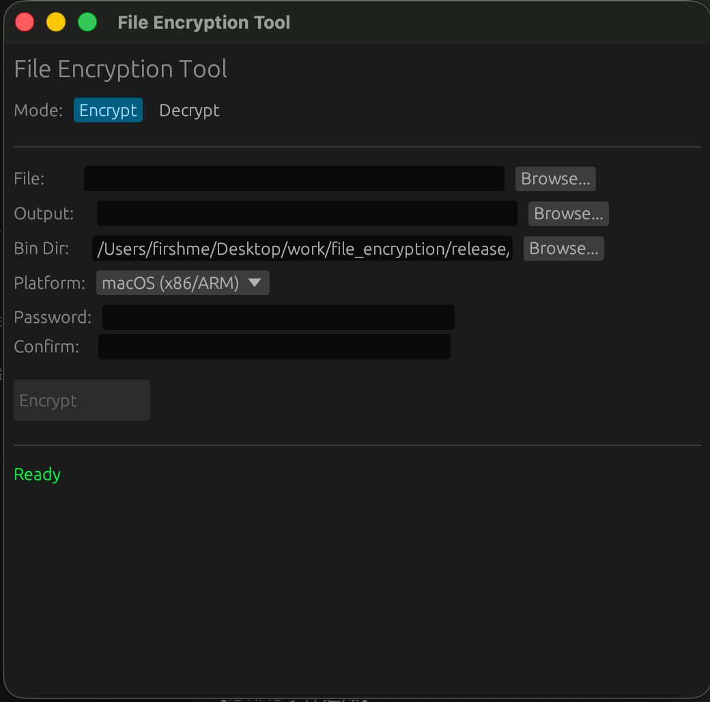

# File Encryption Tool

A cross-platform file encryption tool written in Rust. Encrypts files using DES and packages them as self-extracting executables — no runtime dependencies required on the target machine.

## Features

- Native GUI built with [egui/eframe](https://github.com/emilk/egui) — no Electron, no web stack
- Self-extracting encrypted binaries: the output file is a standalone executable that decrypts itself
- DES encryption with password protection
- CLI tool for scripting and automation
- Cross-platform: macOS, Linux, Windows

## Platform Support

| Platform | Architecture | GUI | CLI Stub |
|----------|-------------|-----|----------|
| macOS | ARM64 (Apple Silicon) | Yes | `task_unix` |
| macOS | x86_64 (Intel) | Yes | `task_unix` |
| Linux | x86_64 | Yes | `task_linux` |
| Linux | ARM64 | Yes | `task_linux_arm64` |
| Windows | x86_64 | Yes | `task.exe` |

## Installation

Download the latest release from the [GitHub Releases](../../releases) page. Each release contains a platform-specific package with the GUI binary and all CLI stubs in a `bin/` subdirectory.

## Usage

### GUI

Run `file-encryption-gui`. The interface has two modes:

- **Encrypt**: select a file, choose the target platform, set a password, and encrypt
- **Decrypt**: select an encrypted file, enter the password, and decrypt

#### window style



### CLI

```bash
# Encrypt a file
./bin/task_unix e <password> <input_file> <output_dir> <platform_id>
```

Platform IDs:

| ID | Platform |
|----|----------|
| 1 | macOS |
| 2 | Windows x86_64 |
| 3 | Linux x86_64 |
| 4 | Linux ARM64 |

**Example:**

```bash
./bin/task_unix e mypassword secret.pdf ./output/ 1
```

### Decrypt (self-extracting)

The encrypted output is a standalone executable. To decrypt, just run it:

```bash
./encrypted_file
# Enter password when prompted
```

## Building from Source

**Prerequisites:** Rust toolchain via [rustup](https://rustup.rs)

```bash
# Build GUI
cargo build --release --bin file-encryption-gui

# Build CLI
cargo build --release --bin task

# Full cross-platform build
bash build_all.sh
```

### Cross-compilation: Linux target (from macOS)

```bash
brew tap SergioBenitez/osxct
brew install x86_64-unknown-linux-gnu
```

Add to `~/.cargo/config.toml`:

```toml
[target.x86_64-unknown-linux-gnu]
linker = "x86_64-unknown-linux-gnu-gcc"
```

### Cross-compilation: Windows target (from macOS)

```bash
sudo port install x86_64-w64-mingw32-gcc
rustup target add x86_64-pc-windows-gnu
cp /opt/local/x86_64-w64-mingw32/lib/* \
  ~/.rustup/toolchains/nightly-x86_64-apple-darwin/lib/rustlib/x86_64-pc-windows-gnu/lib/
cargo build --target x86_64-pc-windows-gnu
```

## Project Structure

```
src/
├── lib.rs          # Library entry point
├── crypto.rs       # Core encryption/decryption logic
└── bin/
    ├── cli.rs      # CLI binary
    └── gui.rs      # Native GUI (egui/eframe)
```

## License

See [LICENSE](LICENSE).
